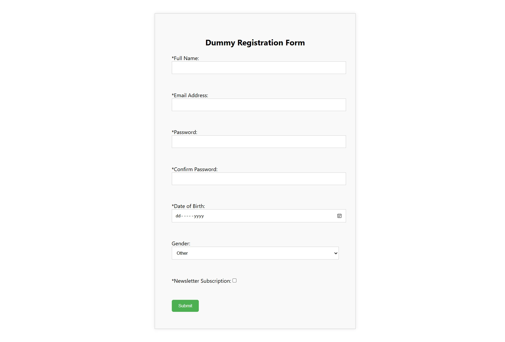

# Dummy Registration App

This is a dummy registration form created on React for demo purposes.

## 👋 Welcome Aboard

This project is based on a mono-repo (single repository) pattern. For your ease of understanding, the core structure of the project is defined below. To get started, read the guidelines provided in the [cypress repo's E2E Testing section](cypress/README.md).

📁 [client](#client)

📁 [cypress](#cypress)

### client

The 📁[client](client/) repo is a react-based project that displays the registration form.

### cypress

The 📁[cypress](cypress/) repo is a Typescript-based Cypress project that helps the QA Engineer perform automated end-to-end tests.

## Tools & Languages

- [Microsoft Visual Studio Code](https://code.visualstudio.com/download)
- [TypeScript](https://code.visualstudio.com/docs/languages/typescript)
- [ReactJS](https://reactjs.org/)
- [Cypress](https://yarnpkg.com/package/cypress)
- [JSON](https://www.json.org/)
- [Yet Another Negotiator (YARN)](https://yarnpkg.com/)
