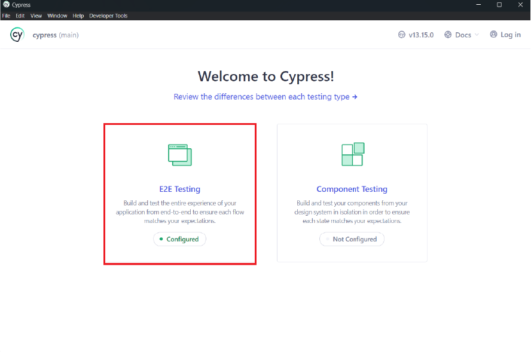
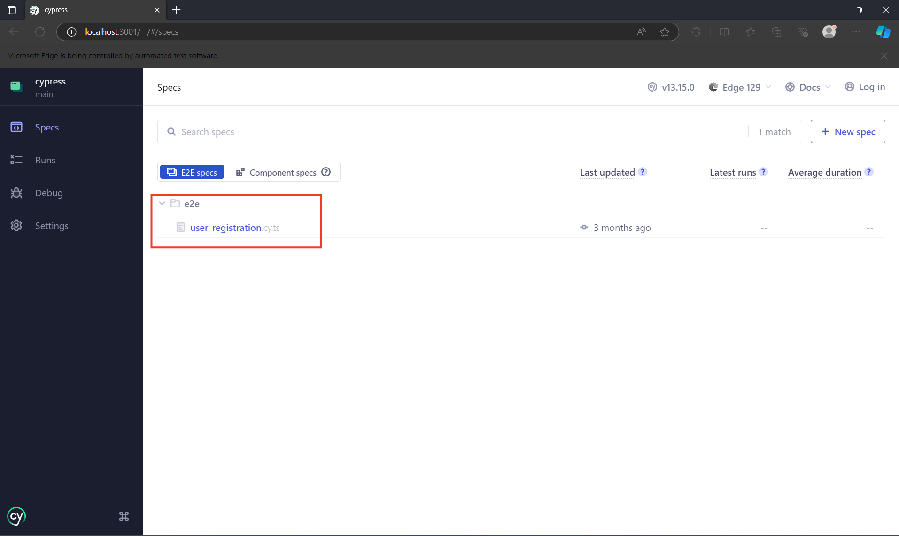
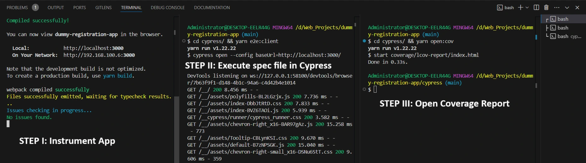
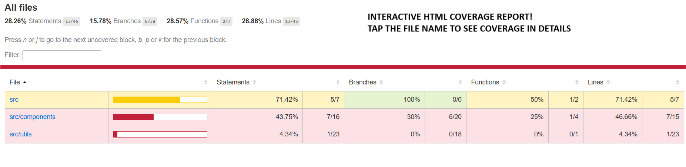

# Getting Started

👋 Welcome to the Cypress Repo.

> Cypress is a next generation end to end testing tool built for the modern web. ([Cypress.io](https://docs.cypress.io/guides/overview/why-cypress#What-you-ll-learn)).

For more information about Cypress, [read the docs](https://docs.cypress.io/guides/).

This repository is based on TypeScript and is designed to help you write end-to-end test cases.

Let's dive into the project structure!

## 📂 Project Structure

```
📦cypress
 ┣ 📂.nyc_ouput
 ┃  ┗ 📜 out.json
 ┣ 📂coverage
 ┃  ┗ 📂lcov-report
 ┃  ┗ 📜clover.xml
 ┃  ┗ 📜.......
 ┣ 📂e2e
 ┃  ┃  ┗ 📜xxxx.cy.ts
 ┣ 📂fixtures
 ┃  ┗ 📜......
 ┣ 📸screenshots
 ┃  ┗ .......
 ┣ 📂support
 ┃  ┗ 📜commands.ts
 ┃  ┗ 📜e2e.ts
 ┣ 📽️videos
 ┃ ┣ 📜.......
 ┣ 📜.gitignore
 ┣ 📜cypress.config.ts
 ┣ 📜package.json
 ┣ 📜README.md
 ┣ 📜tsconfig.json
 ┣ 📜yarn.lock
```

## E2E Testing

Below are the steps that are required to perform end-to-end tests:

- [ ] Split the terminal into two parts A & B respectively.

    

- [ ] In terminal A, navigate to the [client](../client/) repo & run `yarn instrument-app` to instrument the client react app.

- [ ] In terminal B, navigate to the [cypress](../cypress/) repo & run `yarn e2e:client` to open up Cypress.

- [ ] Select **"E2E Testing"** and choose any Chromium-based browser like **MS Edge or Google Chrome**.

    

- [ ] Select the **[user_registration.cy.ts](e2e/user_registration.cy.ts)** file under the [e2e](e2e/) directory

    

- [ ] To view the coverage report, execute `yarn open:cov` in a new terminal C.

    

    
